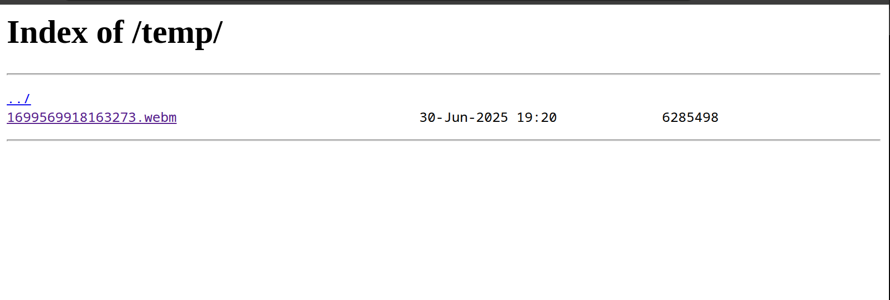
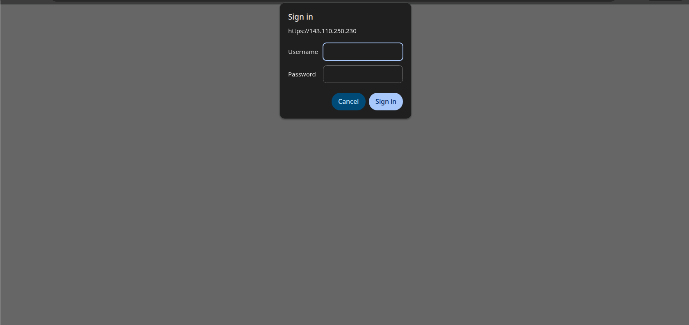

Let's say we need to host some files for friends to access or host an application on our VPS that doesn't have built-in authentication. In that case, we can use Nginx's built-in authentication to add basic authentication to our files or apps.


To use Nginx authentication, we first need to install Nginx. Nginx can be downloaded from https://nginx.org/en/download.html.


Once Nginx is up and running, we need to create a basic Nginx configuration file to authenticate access to the resources.

For example, I have hosted a web video on my VPS. The video is located at /root/temp, and I want my friends to access it. So, first, I will create a simple Nginx configuration file to access the video. I am updating a pre-existing Nginx configuration file to include the following code:

```
location /temp/ {
    root /root;
    autoindex on;
}

```
Now I can go to  ip:/temp/ to access the video.



The video is exposed to the world. Anyone with bit of tikering or the URL can access it.
Lets add a layer of authentication so that  only users with correct username and password can access it.

1. Install `apache2-utils` package from the repository.
2. Once installed, run command `sudo htpasswd -c /etc/nginx/.htpasswd username`. Enter the password and confirm the password.
3. Update the nginx configuration file to add the following two lines to the nginx snippet:
```
location /temp/ {
    root /root;
    auth_basic "Restricted Access";
    auth_basic_user_file /etc/nginx/.htpasswd;
    autoindex on;
   }
```

4. Restart the server by running `systemctl restart nginx`.

Now, if I try to access the same URL, I get a popup asking me to enter the username and password.


----
To access the video, go to https://143.110.250.230/temp/1699569918163273.webm


Username: wsg


Password: wsg


Please note that this is temporary, and the link might no longer be available when you read the blog.
